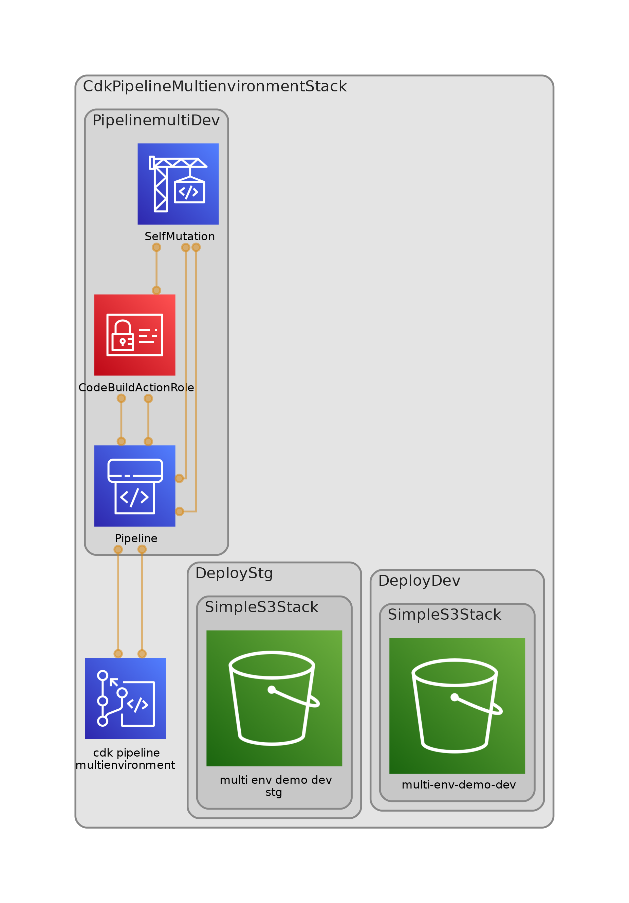

# CDK Pipelines Multi Environment Devployment

This is a project for CDK development with Python for creating multi AWS account deployment.

## Solution Overview

<center>


Solution Overview – Simple CDK Pipeline

</center>
The Figure shows the steps to accomplish this task. Also, it shows a cross account pipeline using AWS CodePipeline, AWS CodeCommit, AWS Codebuild and AWS CloudFormation. But, how can you construct this pipeline secure and with the minimum effort? The answer [CDK Pipelines](https://docs.aws.amazon.com/cdk/v2/guide/cdk_pipeline.html).

This pipeline is a default pipeline composed by next steps:

1.The changes are detected and activate de pipeline. For this demo the branch `master` is the default branch.
2.The CDK project is synthesized.
3.The pipeline run self-update action.
4.The Cloudformation stack is prepared for developer environment.
5.The Cloudformation stack is deployed for developer environment.
6.To move between environments a manual approval step is added.
7.The Cloudformation stack is prepared for staging environment.
8.The Cloudformation stack is deployed for staging environment.

# How to

The `cdk.json` file tells the CDK Toolkit how to execute your app.

This project is set up like a standard Python project. The initialization
process also creates a virtualenv within this project, stored under the `.venv`
directory. To create the virtualenv it assumes that there is a `python3`
(or `python` for Windows) executable in your path with access to the `venv`
package. If for any reason the automatic creation of the virtualenv fails,
you can create the virtualenv manually.

To manually create a virtualenv on MacOS and Linux:

```
$ python3 -m venv .venv
```

After the init process completes and the virtualenv is created, you can use the following
step to activate your virtualenv.

```
$ source .venv/bin/activate
```

If you are a Windows platform, you would activate the virtualenv like this:

```
% .venv\Scripts\activate.bat
```

Once the virtualenv is activated, you can install the required dependencies.

```
$ pip install -r requirements.txt
```

At this point you can now synthesize the CloudFormation template for this code.

```
$ cdk synth
```

To add additional dependencies, for example other CDK libraries, just add
them to your `setup.py` file and rerun the `pip install -r requirements.txt`
command.

## Code structure

The following diagram shows the code stacks and structure.



## Parametrize the project

All project definitions are in `project_configs/environment_options/environment_options_template.yaml`
> Please Visit [avelez](https://dev.to/avelez) in Dev.to for more.

2. Create a new file with name `environment_options.yaml` and change the accounts ids.

3. Deploy main stack `CdkPipelineMultienvironmentStack`

## Useful commands

* `cdk ls`          list all stacks in the app
* `cdk synth`       emits the synthesized CloudFormation template
* `cdk deploy`      deploy this stack to your default AWS account/region
* `cdk diff`        compare deployed stack with current state
* `cdk docs`        open CDK documentation

Enjoy!
